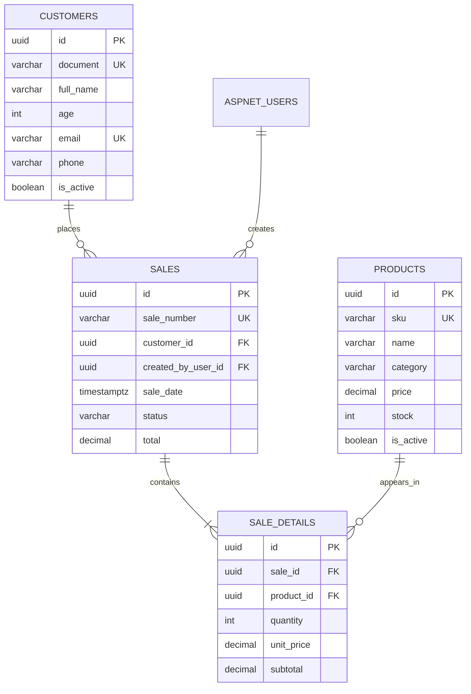
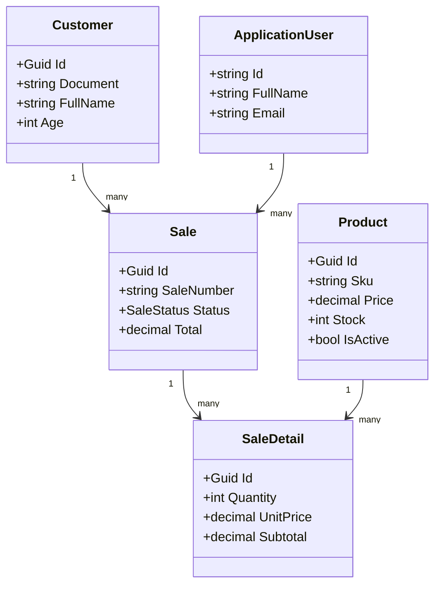

# Diagramas técnicos

## Modelo entidad-relación

```mermaid
erDiagram
    CUSTOMERS ||--o{ SALES : places
    SALES ||--|{ SALE_DETAILS : contains
    PRODUCTS ||--o{ SALE_DETAILS : appears_in
    ASPNET_USERS ||--o{ SALES : creates

    CUSTOMERS {
        uuid id PK
        varchar document UK
        varchar full_name
        int age
        varchar email UK
        varchar phone
        boolean is_active
    }
    PRODUCTS {
        uuid id PK
        varchar sku UK
        varchar name
        varchar category
        decimal price
        int stock
        boolean is_active
    }
    SALES {
        uuid id PK
        varchar sale_number UK
        uuid customer_id FK
        uuid created_by_user_id FK
        timestamptz sale_date
        varchar status
        decimal total
    }
    SALE_DETAILS {
        uuid id PK
        uuid sale_id FK
        uuid product_id FK
        int quantity
        decimal unit_price
        decimal subtotal
    }
```

## Diagrama de clases

```mermaid
classDiagram
    class ApplicationUser {
        +string Id
        +string FullName
        +string Email
    }
    class Product {
        +Guid Id
        +string Sku
        +decimal Price
        +int Stock
        +bool IsActive
    }
    class Customer {
        +Guid Id
        +string Document
        +string FullName
        +int Age
    }
    class Sale {
        +Guid Id
        +string SaleNumber
        +SaleStatus Status
        +decimal Total
    }
    class SaleDetail {
        +Guid Id
        +int Quantity
        +decimal UnitPrice
        +decimal Subtotal
    }
    Customer "1" --> "many" Sale
    Sale "1" --> "many" SaleDetail
    Product "1" --> "many" SaleDetail
    ApplicationUser "1" --> "many" Sale
```
